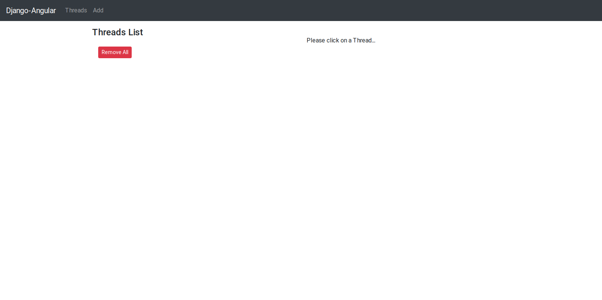
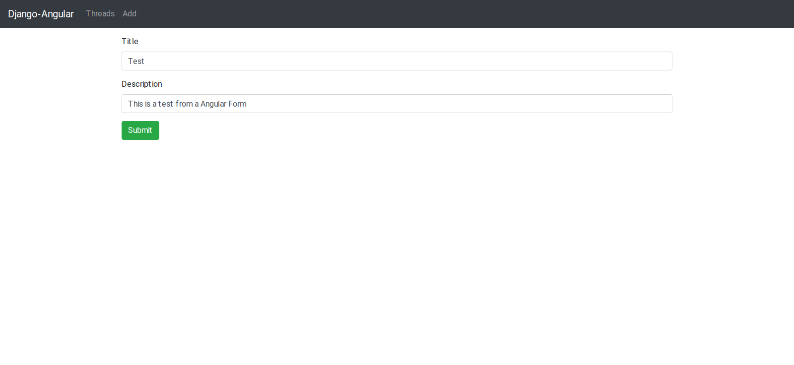
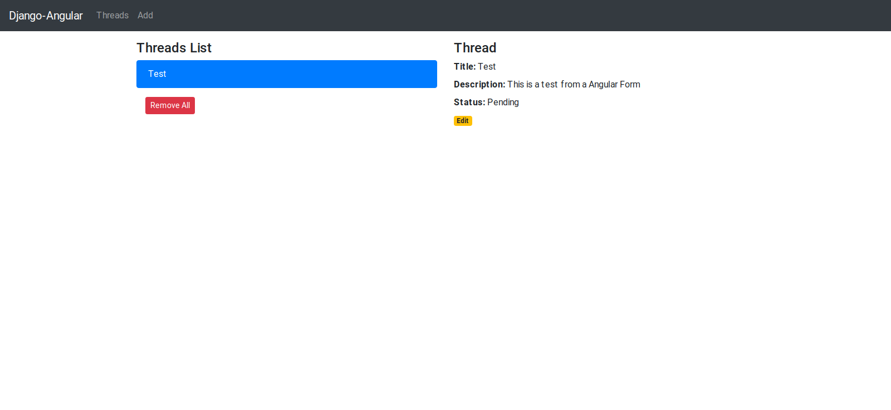

# Django-Angular

This project is a redo of an old project when I was learning how to use Django along with angular.

## Motivation

This project was made to learn Django and integrate it with Angular when I learned how to implement those technologies.

This is just a mock project that show an interface to edit fake discussion thread. It permit to change the title, the description and the status (published or not).

## Screenshot

Let's take a look to the final look of this project

### Homepage

At first the user will see this:

### Add thread

To add a Thread the user just have to click on "Add" on the navbar and a page will be displayed:

### Homepage with thread

Now with a thread created we will se this:

### Edit thread

When we click on a thread detail and a edit button will be displayed, clicking on edit will display this page:

## Tech/Framework

Frontend:
  - Angular9:
    - Typescript
    - HTML5
    - CSS3

Backend:
  -Django:
    - Python 3.8
 
 ## How to run
 
 In backend/backend add a file `crendentials.py` and set your credentials.
 
 In backend open a terminal and run this command: `python manage.py migrate api`
 
 To run the Django part, simply go to backend and open a terminal, run the command: `python manage.py runserver 8080`
 
 To run the Angular part, simply go to frontend and open a terminal, run the command `ng serve --port 8081`
